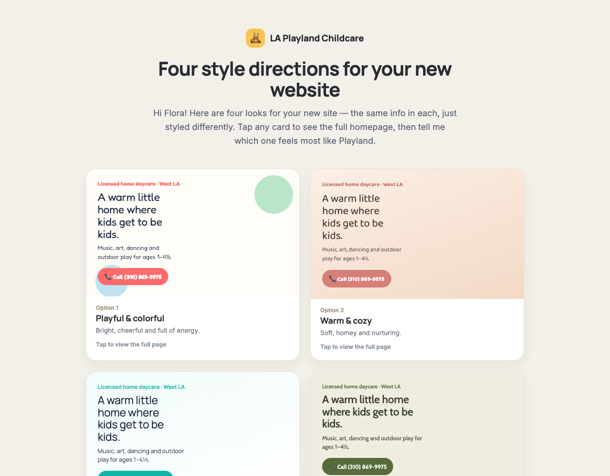
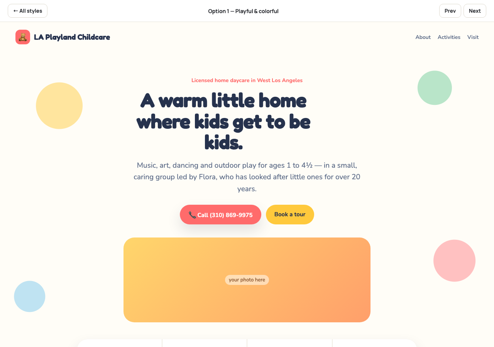
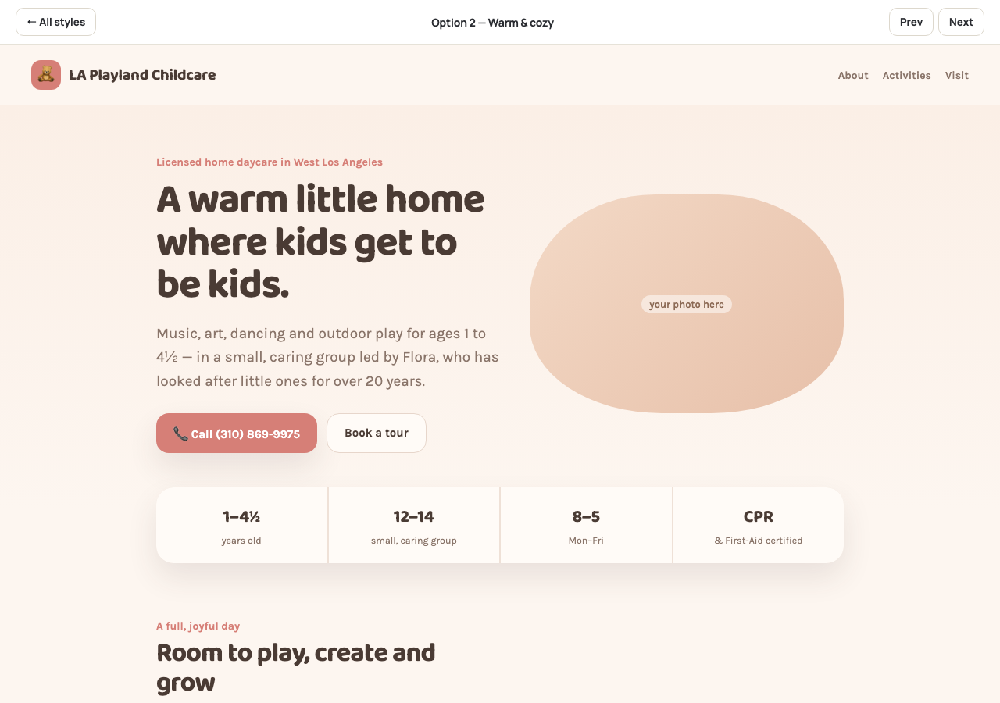
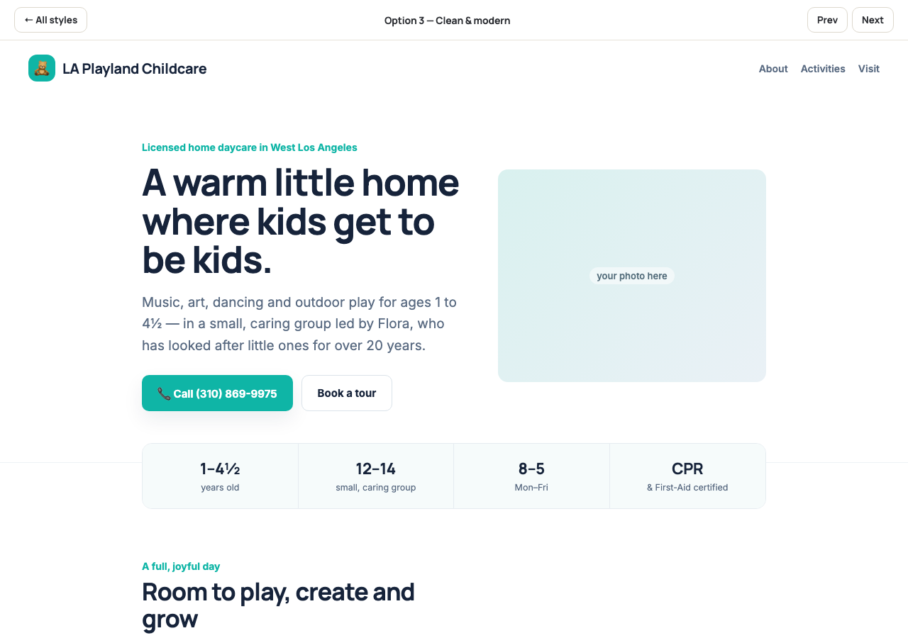
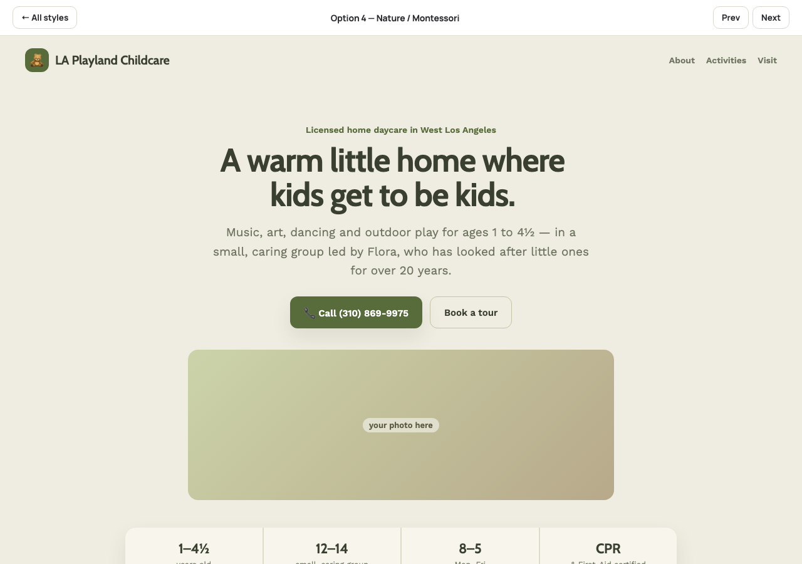
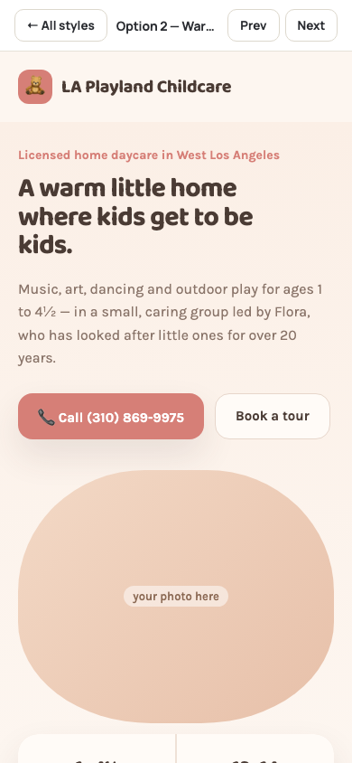

# LA Playland Childcare — Website Style Concepts

Four visual directions for the redesign of a licensed home daycare's website in West Los Angeles, presented to the owner as one interactive page so she could compare them side by side and pick one.

**Live preview:** https://binyamin999.github.io/la-playland-concepts/

## The brief

The client's existing site was an aging WordPress build: slow, full of generic template copy, and with the phone number hard to find. Her top priorities were:

1. **Easy access**: one-tap calling, location and a clear "Book a tour" action
2. **Modern and fast** on phone, tablet and desktop
3. **Accessible** to every visitor

Before building the full site, I designed four directions that use the same content, so the choice comes down to look and feel alone.

## The four directions

| | Style | Palette | Type |
|---|---|---|---|
| 1 | **Playful & colorful**: bright and energetic | `#FF6B6B` `#FFC93C` `#3FA7D6` `#6BCB77` | Fredoka / Nunito |
| 2 | **Warm & cozy**: soft, homey, nurturing | `#D67F77` `#E8A33D` `#8FA689` | Baloo 2 / Karla |
| 3 | **Clean & modern**: calm and professional | `#0FB5A6` `#16233A` | Manrope / Inter |
| 4 | **Nature / Montessori**: earthy and grounded | `#586B3A` `#A9B388` `#C08457` | Cabin / Work Sans |

| Playful & colorful | Warm & cozy |
|---|---|
|  |  |
| **Clean & modern** | **Nature / Montessori** |
|  |  |

  
   <em>Mobile view (Warm & cozy)</em>

## How it's built

- **One static HTML file** with no framework, no build step and no dependencies beyond Google Fonts. It loads fast and hosts free on GitHub Pages.
- **Theming with CSS custom properties.** The homepage markup is rendered once, and each concept is a set of design tokens (colors, fonts, radii, shadows, button styles) plus a few layout overrides, switched with a single `data-theme` attribute.
- **Mobile-first responsive layout** built with CSS Grid and `clamp()` for fluid type and spacing. Columns collapse at tablet and phone breakpoints.
- **Built-in viewer** with a card overview, a full-page preview, and Prev/Next controls so the client can flip between options.

### Accessibility & UX details

- Real `tel:` links for one-tap calling
- Visible `:focus-visible` outlines on all interactive elements
- Honors `prefers-reduced-motion` and includes a dark mode for the overview page
- Semantic landmarks (`main`, `header`, `nav`, `section`, `footer`) and ARIA labels on icon-style controls
- Status messages announced through an `aria-live` region
- System-font fallbacks so text stays readable while web fonts load
- `noindex` so this concept page doesn't compete with the client's live site in search

## Status

Concept stage: the client is choosing a direction, and the chosen one will be built into a full multi-page site. Photos and some copy are placeholders.

---

Designed and built by [Benyamin](https://github.com/Binyamin999).
